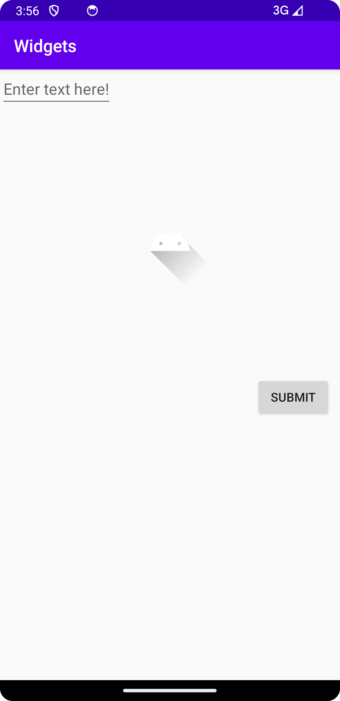

# Rapport

Följande är gjort i denna uppgift, programkod följer efter.

1. Utgick från standard constraint-layouten och skapade en EditText element, 
2. tog bort constraints för att låta den förhålla sig till vänster kant av layouten.
2. Skapade en ImageView element, satte constraints så att den klistrade sig 
under vårt EditText elementet med sitt ID. Satte dessutom en marginTop på 100dp
för att lägga till mellanrum mellan elementen. Satte också contraints relativt 
till parent för höger och vänster så att den blev centrerad.
3. Skapade en ny Button element, satte constraintTop till ImageViews id så den 
lägger sig under bilden, satte contraints för mellanrum över, och vid sidorna, 
samt tog bort constraintRight, så att knappen håller sig till höger kant i layouten.
```

1.
<EditText
        android:id="@+id/editText"
        android:layout_width="wrap_content"
        android:layout_height="wrap_content"
        android:hint="Enter text here!" />
        
2. 
<ImageView
        android:id="@+id/imageView"
        android:layout_width="wrap_content"
        android:layout_height="wrap_content"
        android:src="@drawable/ic_launcher_foreground"
        app:layout_constraintTop_toBottomOf="@id/editText"
        android:layout_marginTop="100dp"
        app:layout_constraintStart_toStartOf="parent"
        app:layout_constraintEnd_toEndOf="parent" />

3. 
<Button
        android:layout_width="wrap_content"
        android:layout_height="wrap_content"
        android:text="Submit"
        app:layout_constraintTop_toBottomOf="@id/imageView"
        android:layout_marginTop="100dp"
        android:layout_marginLeft="10dp"
        android:layout_marginRight="10dp"
        app:layout_constraintEnd_toEndOf="parent" />
```



